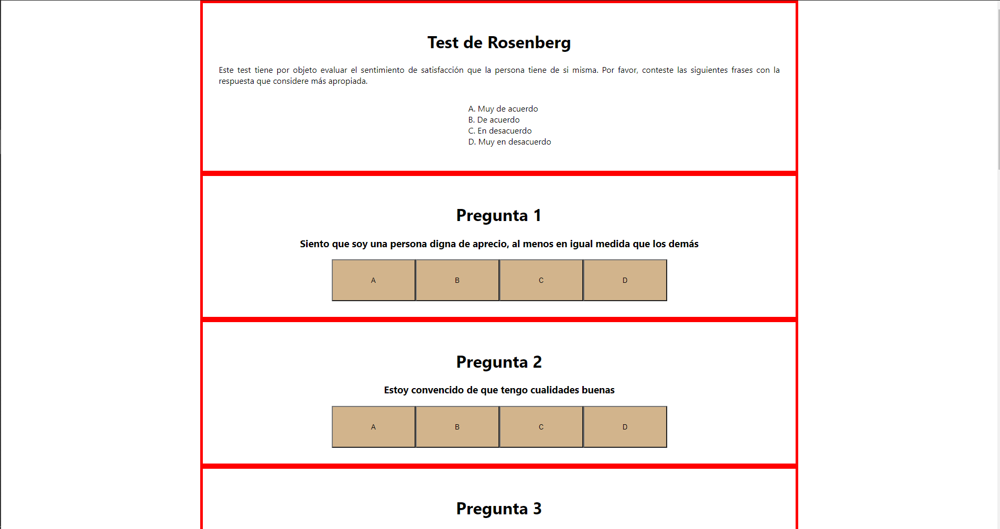
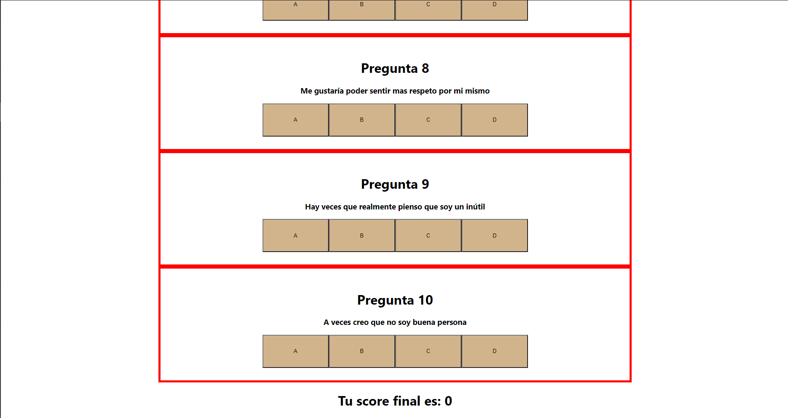

# Rosenberg Test 📎

[Description](https://www.cop.es/colegiados/pv00520/escala%20rosenberg.pdf) about Rosenberg Test

La Escala de Autoestima de Rosenberg es una de las más utilizadas para valorar la autoestima en adolescentes. Fue desarrollada originalmente por Rosenberg en 1965 y traducida al castellano por Echeburua en 1995. La escala incluye diez ítems que valoran sentimientos de respeto y aceptación de sí mismo/a. La mitad de los ítems están enunciados positivamente y la otra mitad negativamente. Los ítems se responden en una escala Likert de cuatro puntos (1= muy de acuerdo, 2= de acuerdo, 3= en desacuerdo, 4= totalmente en desacuerdo). Para su corrección deben invertirse las puntuaciones de los ítems enunciados negativamente (3,5,8,9,10) y posteriormente sumarse todos los ítems. La puntuación total oscila entre 10 y 40. El autor dio permiso para usar la escala con fines clínicos y de investigación.

La escala ha mostrado índices de fiablidad altos: correlaciones test-retest ha variado de 0.82 a 0.88, con alfa de Cronbach en un rango de 0.77 a 0.88 (para más detalle, consultar Blascovich y Tomaka, 1993 y Rosenberg, 1986). En una muestra clínica española adulta y adolescente (Vázquez-Morejón, Jiménez, y Vázquez-Morejón, 2004) se encontró una correlación sustancial entre la escala de autoestima y la puntuación total del SCL-90-R (r = -0.61) y una correlación moderada (r = 0.40) entre la escala y las puntuaciones obtenidas en la Escala de Actitud hacia la Alimentación (EAT) en una muestra de 32 sujetos con diagnóstico de Trastorno Alimentario. El alfa de Cronbach fue de 0.87, similar a estudios previos, y la fiabilidad temporal, tanto para dos meses (r = 0.72) como para un año (r = 0.74), fueron aceptables. En una muestra de 420 estudiantes universitarios (Martín-Albo, Núñez, Navarro y Grijaldo, 2007) se reportó una estructura factorial unidimesional con efecto de método en los ítems positivos.

[Web page about Rosenberg Test](https://bi.cibersam.es/busqueda-de-instrumentos/ficha?Id=206)

## Page in heroku

[Rosenberg Test](https://react-web-rosenberg.herokuapp.com/)

## Screen Shots without styles

This project was bootstrapped with [Create React App](https://github.com/facebook/create-react-app).

## Available Scripts

In the project directory, you can run:

### `yarn start`

Runs the app in the development mode.\
Open [http://localhost:3000](http://localhost:3000) to view it in the browser.

The page will reload if you make edits.\
You will also see any lint errors in the console.

### `yarn test`

Launches the test runner in the interactive watch mode.\
See the section about [running tests](https://facebook.github.io/create-react-app/docs/running-tests) for more information.

### `yarn build`

Builds the app for production to the `build` folder.\
It correctly bundles React in production mode and optimizes the build for the best performance.

The build is minified and the filenames include the hashes.\
Your app is ready to be deployed!

See the section about [deployment](https://facebook.github.io/create-react-app/docs/deployment) for more information.

### `yarn eject`

**Note: this is a one-way operation. Once you `eject`, you can’t go back!**

If you aren’t satisfied with the build tool and configuration choices, you can `eject` at any time. This command will remove the single build dependency from your project.

Instead, it will copy all the configuration files and the transitive dependencies (webpack, Babel, ESLint, etc) right into your project so you have full control over them. All of the commands except `eject` will still work, but they will point to the copied scripts so you can tweak them. At this point you’re on your own.

You don’t have to ever use `eject`. The curated feature set is suitable for small and middle deployments, and you shouldn’t feel obligated to use this feature. However we understand that this tool wouldn’t be useful if you couldn’t customize it when you are ready for it.
